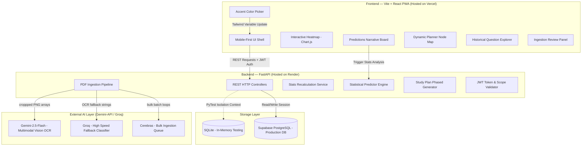
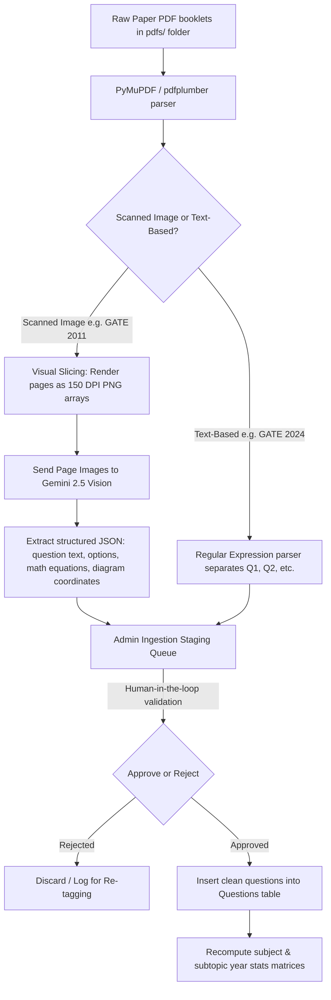

# ExamArchitect — Comprehensive Project Guide & Technical Interview Blueprint

This document acts as a complete guide explaining the ExamArchitect platform from scratch, detailing architectural decisions, database topologies, visual diagrams, and typical technical questions asked during code reviews and engineering interviews.

---

## 🏗️ System Architecture & Data Flows

ExamArchitect is built as a highly decoupled full-stack application, utilizing **React 19** for user interactions, **FastAPI** for core services and calculations, and a dual **SQLite/Supabase** storage strategy.

### 1. Unified Architecture & REST API Loop
The diagram below shows how requests flow from the frontend PWA shell down to backend services and external LLMs.

---

## 🔄 Core Data Pipeline Flows

### 1. Ingestion Pipeline (PDF to SQL DB)
This flow highlights how raw PDF booklet scans are sliced, parsed, reviewed, and finalized in the database.

### 2. Prediction Engine Mathematical Formula
The statistical prediction engine evaluates the probability of a topic appearing in the upcoming exam by aggregating:
1. **Frequency Weight:** The total appearances of the topic over the past 12 years.
2. **Recency Bias (Exponential Decay):** More recent years carry higher weight (e.g. appearances in 2025 impact predictions more than appearances in 2015).
3. **Difficulty Shift:** Tracking whether questions in this topic are getting progressively harder.

---

## 🤖 AI Systems & Model Matrix

The platform implements a **hierarchical fallback AI stack** to ensure 100% free uptime under high-traffic ingestion loads:

| Model | Core Role | Why Selected |
| :--- | :--- | :--- |
| **Google Gemini 2.5 Flash** | **Primary Multimodal Engine** | Selected for its exceptional visual extraction capabilities. Parses LaTeX mathematical formulas and coordinates diagrams on raw scanned pages. It also generates the prediction narratives and powers the AI Syllabus Mentor. |
| **Groq (Llama-3)** | **High-Speed Classifier & Fallback** | Used for real-time validation and quick difficulty classification because of its extremely low token latency. |
| **Cerebras (Llama-3)** | **Bulk Batch Processing** | Provides extremely high throughput, ideal for re-indexing hundreds of historical questions without hitting rate limits. |

---

## 💬 Interviewer FAQ & Architecture Trade-offs

### 1. Backend: Why FastAPI and not Express (Node.js) or Django?
* **Python AI Ecosystem:** Python is the native environment for AI/ML pipelines (multimodal OCR, visual coordinate cropping, mathematical statistics modeling, and local HuggingFace embeddings). Express would require spawning subprocesses to call Python scripts, introducing latency.
* **FastAPI Performance:** Built on Starlette and Uvicorn, FastAPI provides asynchronous concurrency speeds that rival Node.js.
* **Type Safety:** Automated Pydantic model validation guarantees strict schema constraints at entry points.

### 2. Database: Why SQLite locally and PostgreSQL (Supabase) in production?
* **SQLite (Zero Config):** Local SQLite file DBs are excellent for local setups. They enable instant developer onboarding without database credentials.
* **Supabase PostgreSQL (Scale & RLS):** Supabase provides a hosted Postgres instance. We configured **27 Row-Level Security (RLS) policies** to lock database access:
  * Public tables (e.g., questions, papers, exam categories) have read-only SELECT permissions for anonymous users.
  * User-generated tables (e.g., user study plans, mock exam records) restrict insert/update actions to the authenticated user owning the row.
* **Mock Isolation:** We intercept database connectivity inside unit tests (`pytest`). Tests spin up an in-memory SQLite context, preventing any mock updates or tables truncation from corrupting the production Supabase database.

### 3. Styling: Why Vanilla CSS variables instead of Tailwind utility overload?
* **Design Control:** Vanilla CSS with HSL variables provides deep, harmomious design controls. We can easily transition colors (indigo to amber to rose) inside animations and visual elements (like Three.js or canvas grids).
* **Code Maintenance:** Tailwind files can get cluttered with utility classes. Structuring key frames and custom animations in clean `.css` files keeps React markup readable.

### 4. AI: Why a statistical regression model instead of asking an LLM for predictions?
* **Reliability:** LLMs are prone to hallucinating. If you ask an LLM "which topics will come in GATE CS 2027", it makes educated guesses or makes up fake syllabus parameters.
* **Transparency:** ExamArchitect computes probabilities using clear mathematical formulas (frequency, exponential decay, recency decay). This allows users to inspect exactly *why* a topic is flagged as critical.

---

## 🛠️ Pull Request & Automated CI/CD Workflows

To ensure high code quality, we implement a **GitHub Actions CI Pipeline** (defined in `.github/workflows/ci.yml`).

### Proposed PR Validation Setup:
1. **PR Created:** A developer opens a pull request to merge a branch (e.g., `feature/analytics`) into `main`.
2. **Automated Pipeline Triggered:**
   - **Backend Verification:** Boots Python, installs dependencies, runs static code lints (`flake8`), and executes `pytest` tests using the local SQLite sandbox.
   - **Frontend Verification:** Boots Node.js, installs dependencies, and runs `npm run build` (confirming that Vite compiles React 19 / JSX into production chunks without errors).
3. **Manual Merging:**
   - The repository owner checks the CI pipeline status.
   - Once all automated checks pass, the owner approves and merges the PR.

### Does pushing to Git automatically redeploy the app?
**Yes, when configured with webhooks:**
* **Frontend (Vercel):** Connected directly to the GitHub repository. Pushing or merging to the `main` branch triggers an automated Vercel production deployment.
* **Backend (Render):** Connected via a blueprint configuration linked to this repository. Pushing to `main` sends a webhook to Render, triggering an automated rebuild and restart.
